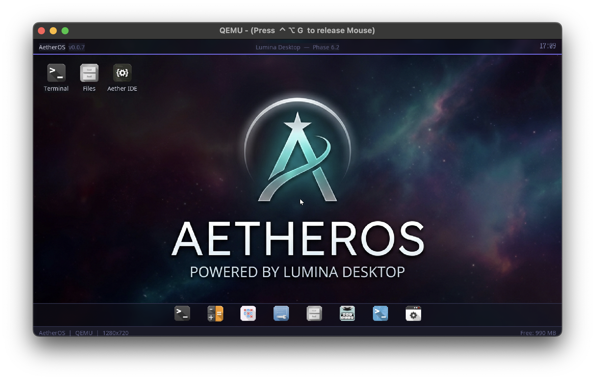
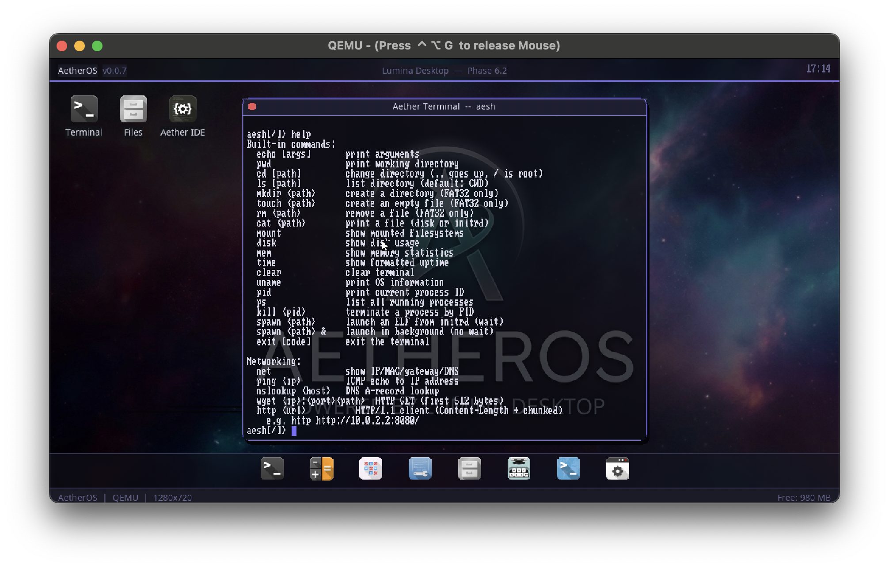
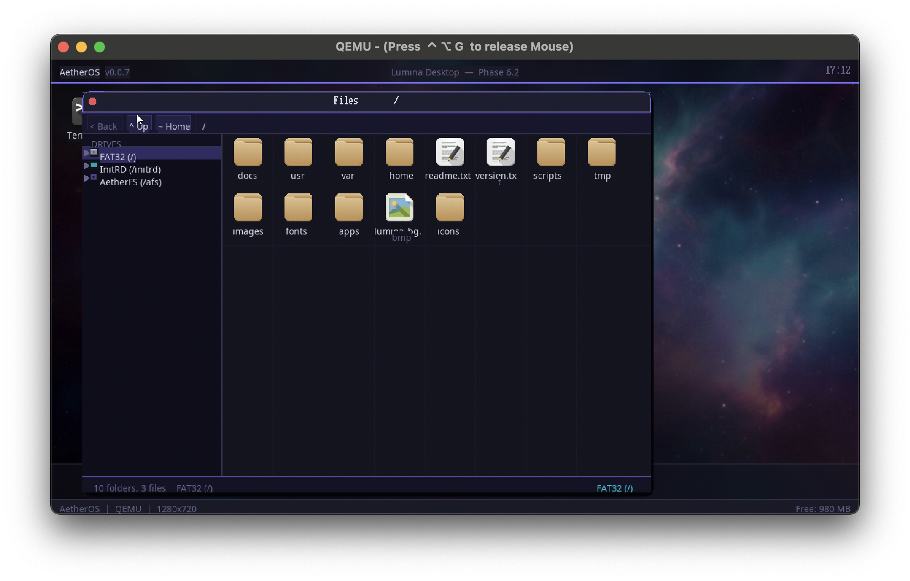
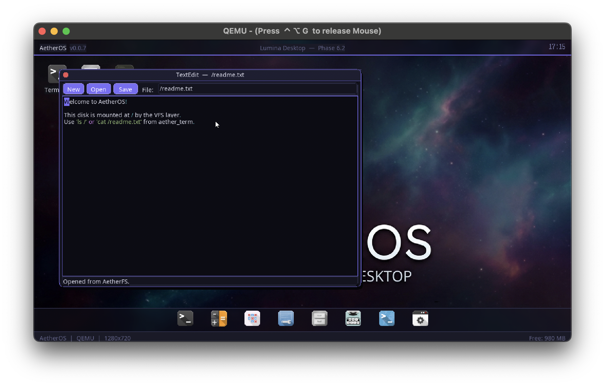
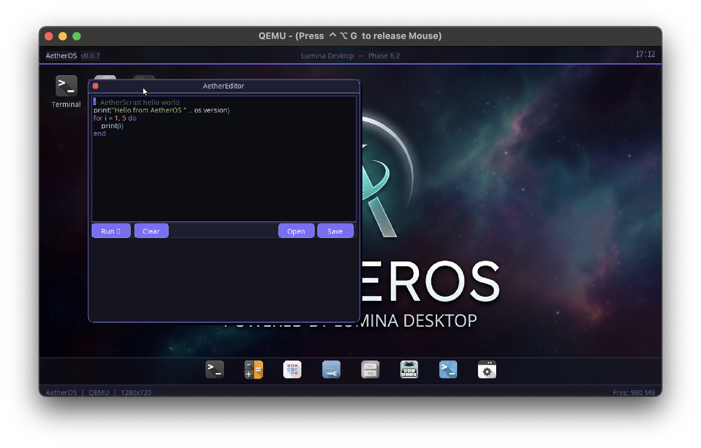
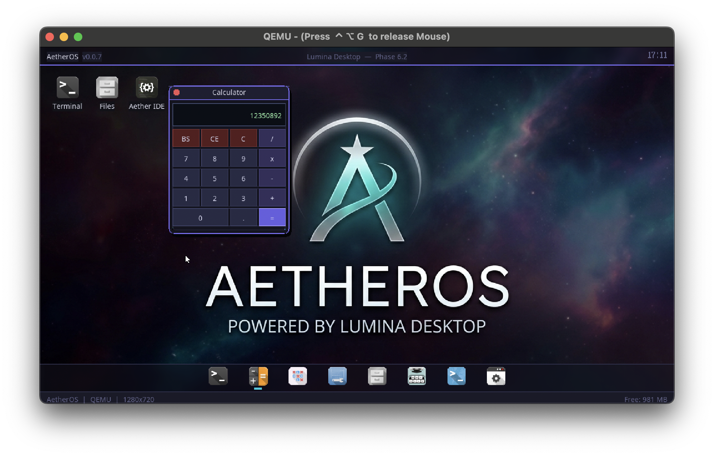
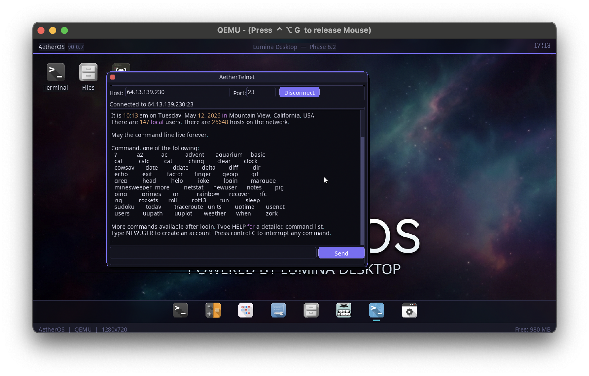
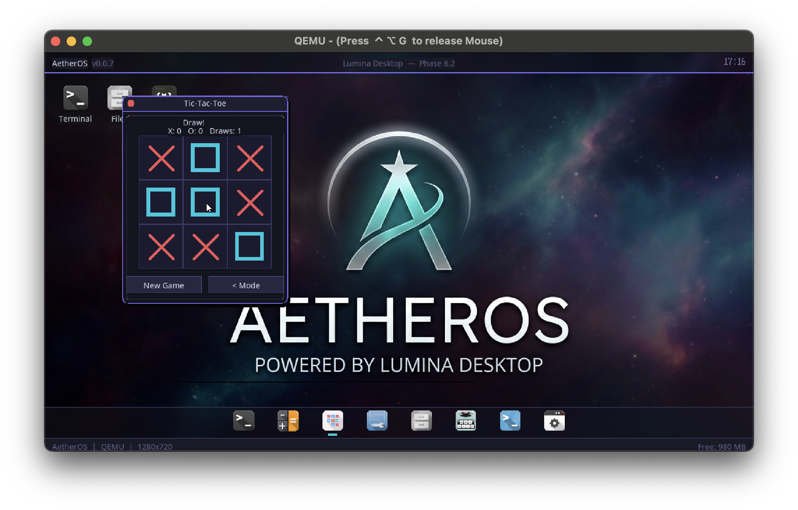
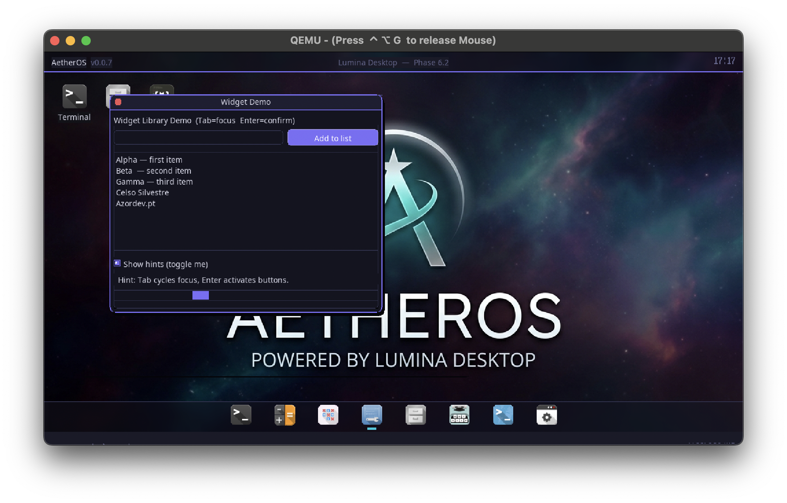
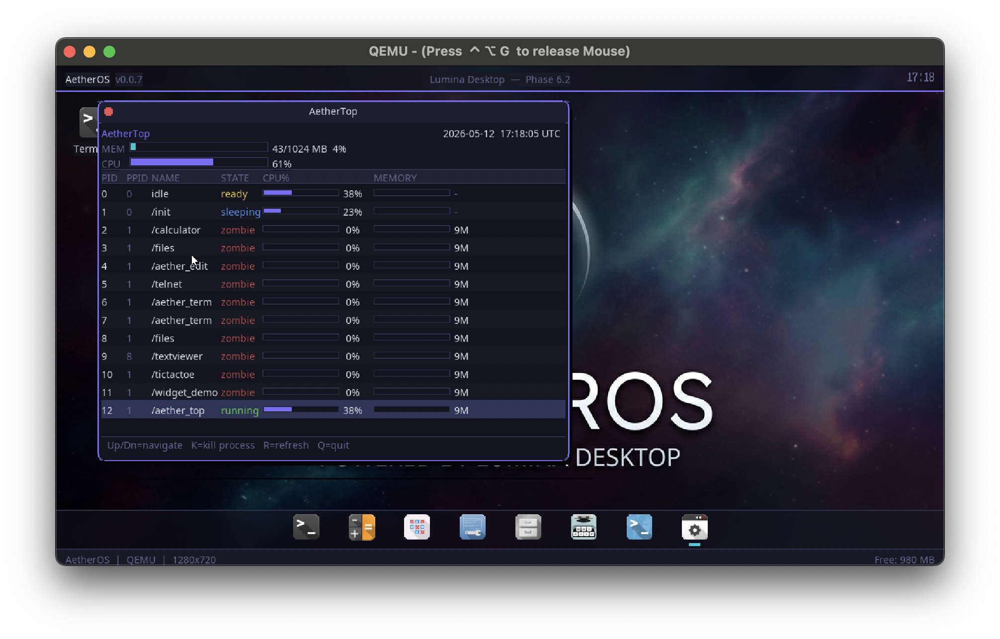

# AetherOS
AetherOS is an experimental hobby operating system built from scratch, specifically designed for the Raspberry Pi 5 (AArch64) architecture. It emphasizes a modern development workflow using QEMU for emulation and testing.



## Table of Contents
[Why AetherOS](#why-aetheros)
[About](#about)
[Project Features](#project-features)
[Project Structure](#project-structure)
[Getting Started](#getting-started)
[Building the Project](#building-the-project)
[Running AetherOS](#running-aetheros)
[Core Applications](#core-applications)
[Contributing](#contributing)
[License](#license)

## Why AetherOS
### 1. Mythological & Philosophical Roots
"Aether" (or Æther) comes from ancient Greek cosmology — it was believed to be the pure, luminous substance that filled the upper heavens, the medium through which light traveled, and the fifth element beyond earth, water, air, and fire. This maps well to an OS that aims to be:
- *Pure*: Built from scratch without legacy baggage
- *Luminous*: Visually striking and modern
- *Fundamental*: The underlying medium that makes everything else possible

### 2. Historical Scientific Resonance
In 19th-century physics, the *"luminiferous aether"* was the hypothesized medium for electromagnetic waves. While the concept was superseded by Einstein's relativity, it represented humanity's attempt to understand the invisible substrate of reality — much like an OS is the invisible substrate that makes hardware usable.

### 3. Modern Tech Connotations
Ethereum (the blockchain) derives from the same root, suggesting a modern, decentralized, forward-thinking ethos
Aether sounds lightweight and fast — exactly what you want for a Raspberry Pi OS
The "OS" suffix is clean and immediately recognizable

### 4. Practical Branding Considerations
Unique: No major OS uses this name (unlike "Nova," "Zenith," etc.)
Pronounceable: Three syllables, easy to say in any language
Flexible: Works for the shell (aesh), the libc (libaether), the UI toolkit, etc.
Domain-friendly: Likely available for future project websites

### 5. The "Lumina" Design Language Connection
The visual design system name "Lumina" (light) directly echoes the aether's association with light and luminosity — creating a cohesive brand story from the kernel to the pixels.
It essentially captures the spirit of building something fundamental, pure, and illuminating from the ground up.

## About
AetherOS is a learning-focused operating system kernel development project. It aims to provide a clean, manageable environment for understanding low-level systems programming on AArch64 hardware. By utilizing CMake and QEMU, the project ensures a consistent and efficient development cycle.

## Project Features
- Target Architecture: Optimized for Raspberry Pi 5 (AArch64).

- Development Workflow: Streamlined integration with QEMU for rapid testing without requiring physical hardware for every iteration.

- Modular Design: Organized structure separating kernel internals, user-space components, and build scripts.

- Build System: Managed entirely via CMake for portability and ease of configuration.

## Project Structure
The repository is organized as follows:

```Plaintext
.
├── cmake/          # CMake helper modules
├── docs/           # Documentation and design notes
├── kernel/         # Core kernel source code
├── scripts/        # Utility scripts for development
├── userspace/      # User-space applications and libraries
├── CMakeLists.txt  # Main build configuration
└── run_qemu.sh     # Script to launch the OS in QEMU
```

## Getting Started
### Prerequisites
To build and run AetherOS, you will need the following tools installed on your system:

- **AArch64 Cross-Compiler**: (e.g., aarch64-none-elf-gcc or equivalent).

- **CMake**: Version 3.x or higher.

- **QEMU**: System emulator configured for aarch64.

- **Make/Ninja**: Build tools compatible with your CMake configuration.

## Building the Project
Navigate to the root of the repository and run the following commands to configure and build:

```Bash
mkdir build
cd build
cmake ..
make
```

## Running AetherOS
You can run the project using the provided helper script:

```Bash
./run_qemu.sh
```

*(Ensure that your environment is properly set up to support QEMU and the generated kernel image.)*

## Core applications

### Aether Terminal
A graphical terminal for interaction with AetherOS


### Files browser
File browser to view the files in the FS. The app can show the content of the several drives mounted in the system like: initRD, FAT32 and AetherFS mounts if available.
Double clicking one txt file will automayically open it in the Text Editor application, while the scripts file (.as) will open directly in the Script Editor.


### Text Editor
Default application for viewing and editing text files. It has the basic text editor capabilities.


### Scripts Editor
AetherOS supports LUA 5.4 scripting. This is the basic IDE for developing applications and running inside AetherOS.


### Calculator
Self-explanatory application, however a fundamental piece of every operative system. The calculator allow users to make basic math calculations.


### Telnet
Telnet client application. Allows the connection to external resources and test connectivity to several services.


### Tic Tac Toe
Because all OS should have at least one game ;) AetherOS comes with the well know Tic Tac Toe. It can be used in 2 modes. Agains other Humman or Against the CPU. Are you sure that you can beat the CPU?


### Widget Demo
Application to demonstrate the several widgets available in the libwidget library. Currently are available the following widgets:
- Button
- Checkbox
- Label
- Listview
- Panel
- Scrollbar
- Textarea
- Textinput
- Tree view
- Progress bar


### Aether Top
Resource monitor and realtime process visualization tool.


## Contributing
As this is a hobby OS project, contributions are welcome! If you have ideas for improvements, bug fixes, or new features, feel free to open an issue or submit a pull request.

## License
MIT License

Copyright (c) 2026 Celso Silvestre (azordev.pt)

Permission is hereby granted, free of charge, to any person obtaining a copy
of this software and associated documentation files (the "Software"), to deal
in the Software without restriction, including without limitation the rights
to use, copy, modify, merge, publish, distribute, sublicense, and/or sell
copies of the Software, and to permit persons to whom the Software is
furnished to do so, subject to the following conditions:

The above copyright notice and this permission notice shall be included in all
copies or substantial portions of the Software.

THE SOFTWARE IS PROVIDED "AS IS", WITHOUT WARRANTY OF ANY KIND, EXPRESS OR
IMPLIED, INCLUDING BUT NOT LIMITED TO THE WARRANTIES OF MERCHANTABILITY,
FITNESS FOR A PARTICULAR PURPOSE AND NONINFRINGEMENT. IN NO EVENT SHALL THE
AUTHORS OR COPYRIGHT HOLDERS BE LIABLE FOR ANY CLAIM, DAMAGES OR OTHER
LIABILITY, WHETHER IN AN ACTION OF CONTRACT, TORT OR OTHERWISE, ARISING FROM,
OUT OF OR IN CONNECTION WITH THE SOFTWARE OR THE USE OR OTHER DEALINGS IN THE
SOFTWARE.